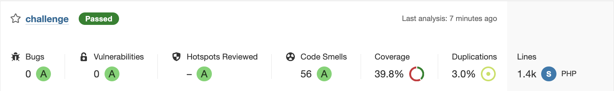

# Challenge seQura

## Requisitos:
- Docker
- Docker Compose
- Don't edit .env or .env.test

## Usage:
In a CLI, navigate to the `challenge` directory and execute the `make build` command
##### The process will run the necessary Docker containers for the project, import the data, execute the challenge processes, and display a table with the results.

## Code:
The code used for the challenge (not including tests, migrations, and infrastructure)::

````
app
|-- Console
|   |-- Commands
|      |-- GenerateDisbursements.php
|      |-- ImportMerchants.php
|      |-- ImportOrders.php
|      `-- Summary.php
|   
|-- Contracts
|   |-- AdditionalFeeInterface.php
|   |-- DisbursementRepositoryInterface.php
|   |-- FileDownloaderInterface.php
|   |-- MerchantImporterInterface.php
|   |-- MerchantRepositoryInterface.php
|   |-- OrderImporterInterface.php
|   `-- OrderRepositoryInterface.php
|-- DTOs
|   |-- AdditionalFeeData.php
|   |-- DisbursementData.php
|   |-- MerchantData.php
|   `-- OrderData.php
|-- Models
|   |-- AdditionalFee.php
|   |-- Disbursement.php
|   |-- Merchant.php
|   `-- Order.php
|-- Providers
|   `-- AppServiceProvider.php
|-- Repositories
|   |-- EloquentAdditionalFeeRepository.php
|   |-- EloquentDisbursementRepository.php
|   |-- EloquentMerchantRepository.php
|   `-- EloquentOrderRepository.php
`-- Services
    |-- CsvReader.php
    |-- CurlFileDownloader.php
    |-- DisbursementService.php
    |-- MerchantDataTransformer.php
    |-- MerchantImporterFromCsv.php
    |-- OrderDataTransformer.php
    `-- OrderImporterFromCsv.php
````
The result of the SonarQube analysis

> Smells and tech debt are from naming conventions and some framework files, the code coverage could be improved with more tests (I don'w know why but Sonar also includes for coverage calculation the tests files code, real coverage is higher).

## Security and Traceability:
- Creation of four tables in the database: disbursements, merchants, additional_fees, and orders.
- Addition of technical fields in the orders and merchants tables for traceability (ingest_date, source).
- Replacement of the CSV id with external_id in the orders and merchants tables, with a local id as the primary key.

## Performance and data handling:
- Performance optimization by reading the merchants CSV over the network.
- Part-by-part download of the orders CSV to avoid timeouts.
- Import of more than one million orders in ~6-7 minutes on a 2021 MacBook M1 Pro (16GB RAM, 1GB memory for PHP).
- Logging of orders with erroneous data in the Laravel log.
- The existence of the merchant is not verified in each imported order to improve performance..

## Design and architecture decisions:
- Choice of Laravel due to its similarity with Ruby on Rails and focus on clean, well-tested code following SOLID principles.
- Use of anemic models and moving logic to services, avoiding breaking the philosophy of the framework.

## Repositories and tables management:
- Design of repositories and tables addressed to prevent the insertion of duplicate records.

## Errors and exceptions:
- Identification of 8 orders with errors during the import process.

## The process for each merchant is as follows:
* We check if they are eligible for disbursement based on the day the command is being executed, if so:
    * We retrieve orders (not disbursed) for a date range, either from the previous day or from the start of the week corresponding to the previous day
    * For each order:
        * We calculate the commission
        * We mark it as paid
    * We calculate whether the minimum commission amount has been reached and save it
    * We save the total disbursement for the N orders previously retrieved
    * If it is the first day of the month, we calculate if the merchant has reached the minimum and save the difference if it exists

## Results:
The total process (installation, importation, generation, and data retrieval) runs in ~9.5 minutes on a 2021 MacBook M1 Pro (16GB RAM, 1GB memory limit for PHP).

````
+------+-------------------------+-------------------------------+----------------------+--------------------------------+-------------------------------+
| Year | Number of Disbursements | Amount Disbursed to Merchants | Amount of Order Fees | Number of Monthly Fees Charged | Amount of Monthly Fee Charged |
+------+-------------------------+-------------------------------+----------------------+--------------------------------+-------------------------------+
| 2022 | 120                     | 75.732,91  €                  | 725,37 €             | 2                              | 22,01 €                       |
| 2023 | 1252                    | 2.650.626,60 €                | 23.894,26 €          | 16                             | 159,17 €                      |
+------+-------------------------+-------------------------------+----------------------+--------------------------------+-------------------------------+
````

## Areas for Improvement:
- Improve testing and implement Behat to prevent regressions and ensure scalability of the project.
- Multi-threading to enhance the performance of imports and other operations.
- Refactor the Summary and DisbursementService classes to adhere more closely to SOLID principles (especially encapsulating responsibilities).
- Remove Laravel examples and skeleton.
- The design of the tables is improvable; it was done quickly yesterday morning to save time, the price paid was a single 'complicated' query.
- Optional: Maybe some subdirectories could be created within Services and Contracts for better organization of files, but it didn't seem necessary due to the small number.
